# MIDI-grep

Extract piano riffs from audio files or YouTube videos and generate [Strudel](https://strudel.dygy.app/) code for live coding.

```
Audio/YouTube → Stem Separation → MIDI Transcription → Strudel Code
```

## Features

- **YouTube Support**: Paste a URL, get playable code
- **AI-Powered Separation**: Demucs isolates melodic/bass/drums/vocals stems
- **Drum Pattern Detection**: Extracts kick, snare, hi-hat patterns automatically
- **Accurate Transcription**: Spotify's Basic Pitch for audio-to-MIDI
- **BPM & Key Detection**: Automatic tempo and musical key analysis with confidence scores
- **Detection Candidates**: Shows top 5 candidates for key, BPM, time signature, and style in output header
- **Smart Caching**: Stems cached by URL/file hash; auto-invalidates when processing scripts change
- **Chord Mode**: Alternative chord-based generation for electronic/funk music (`--chords`)
- **Loop Detection**: Automatically identifies repeating patterns (1, 2, 4, or 8 bar loops) with confidence scoring
- **Genre Auto-Detection**: Automatically detects genre and uses specialized generators:
  - **Brazilian Funk**: BPM 130-145 (136 typical), mid-heavy spectrum, vocal chops → uses tamborzão templates
  - **Brazilian Phonk**: BPM 80-100 or 145-180, darker sound → phonk-style drums
  - **Retro Wave/Synthwave**: BPM 130-170, longer synth notes → synthwave style
  - **Style Detection**: Detects style based on BPM, key (minor/major), and note density
- **Deep Learning Genre Detection**: CLAP (Contrastive Language-Audio Pretraining) model for zero-shot audio classification (enabled by default)
- **Manual Genre Override**: `--genre` flag to force specific genre when auto-detection fails
- **AI-Driven Audio Rendering**: Synthesize WAV previews with AI-suggested mix parameters
  - Spectral/dynamics/timbre analysis of original audio
  - Automatic effect parameter optimization
  - Rendered vs original comparison with similarity scoring
- **Self-Contained HTML Report**: Single-file report with everything embedded
  - **Audio Studio Player**: Two-section stem mixer (Original + Rendered)
  - Solo/Mute controls per stem with waveform visualization
  - A/B comparison mode (toggle between original and rendered)
  - Per-stem comparison charts (bass, drums, melodic)
  - Visual comparison charts (spectrograms, chromagrams, frequency bands)
  - Copyable analysis data tables
  - Strudel code with copy button
- **Dynamic Strudel Output**: Rich patterns with per-voice effects
  - `.velocity()` patterns with dynamic range expansion for expressive dynamics
  - Style-specific accent patterns (downbeat, backbeat, offbeat)
  - Compressor effect for dynamics control (electronic)
  - Per-voice filtering (HPF/LPF by register)
  - Stereo panning with style-appropriate LFO shapes (sine, perlin, saw)
  - ADSR envelopes for synth/orchestral styles
  - Voice-appropriate reverb, delay, phaser, vibrato
  - Style-specific FX: bitcrush/coarse for lofi, distort for electronic
  - FM synthesis (.fm, .fmh, .fmdecay) for synth/electronic richness
  - Tremolo/amplitude modulation for synth/orchestral movement
  - Filter envelope (.lpenv, .lpattack, .lpdecay) for dynamic sweeps
  - Sidechain/ducking (.duck, .duckattack, .duckdepth) for electronic pumping
  - Ring modulation (.ring, .ringfreq) for metallic timbres
  - Chorus (.chorus, .chorusDepth) for warm width (jazz/soul)
  - Leslie effect (.leslie, .leslieSpeed) for organ-style modulation
  - Shape/saturation (.shape) for harmonic warmth
  - Pitch envelope (.pitchenv, .pitchattack) for synth bass punch
  - Pattern transforms: swing for jazz, degradeBy for lofi, iter for electronic/lofi variation
  - `.clip()` for note duration control (staccato/legato/sustained)
  - `.echo()` for rhythmic repeats
  - `.superimpose()` for detuned layering (synth richness)
  - `.off()` for harmonic layering with time offset
  - `.layer()` for parallel transformations (orchestral octave doubling)
  - `.echoWith()` for sophisticated pitch-shifted echoes (electronic)
  - `.scale()` for key-aware quantization
  - Section detection with time markers
- **Sound Style Presets**: 20+ styles with auto-detection
  - **GM Soundfont**: `piano`, `synth`, `orchestral`, `electronic`, `jazz`, `lofi`
  - **Groove Styles**: `funk`, `soul`, `house`, `trance` (auto-detected by BPM/key)
  - **Raw Oscillators**: `raw`, `chiptune`, `ambient`, `drone`, plus `supersaw`, ZZFX synths
  - **Sample-based**: `mallets`, `plucked`, `keys`, `pad`, `percussive`
  - **Genre-specific**: `synthwave`, `darkwave`, `minimal`, `industrial`, `newage`
- **Extended Sound Palette**:
  - **Supersaw**: Fat detuned sawtooth for bass/leads
  - **ZZFX Synths**: 8-bit style (`z_sawtooth`, `z_square`, `z_triangle`, `z_tan`, `z_noise`)
  - **Wavetables**: Digital waveforms (`wt_digital`, `wt_vgame`, `wt_piano`)
  - **Noise**: Textural elements (`white`, `pink`, `brown`, `crackle`)
- **Web Interface**: HTMX-powered UI, no JavaScript frameworks
- **CLI Tool**: Full-featured command-line interface

## Architecture

```
                              MIDI-grep Pipeline

   INPUT            SEPARATE          ANALYZE           TRANSCRIBE        OUTPUT
     │                 │                 │                  │                │
     ▼                 ▼                 ▼                  ▼                ▼
┌─────────┐     ┌────────────┐     ┌───────────┐     ┌──────────────┐    ┌─────────┐
│ YouTube │     │  Demucs    │     │  librosa  │     │ Basic Pitch  │    │ Strudel │
│ yt-dlp  │────▶│   stem     │────▶│  BPM/Key  │────▶│ Audio → MIDI │───▶│  code   │
│ WAV/MP3 │     │ separation │     │  + CLAP   │     │ Drum onset   │    │  + WAV  │
└─────────┘     └────────────┘     └───────────┘     └──────────────┘    └─────────┘
                    │                  │
                    ▼                  ▼
              ┌──────────┐      ┌───────────┐
              │ melodic  │      │  Genre    │
              │ bass     │      │ Detection │──┬── Standard: note transcription
              │ drums    │      │           │  │
              │ vocals   │      └───────────┘  └── Template: Brazilian funk/phonk
              └──────────┘

────────────────────────────────────────────────────────────────────────────────
                              Tech Stack

  Go 1.21+                              Python 3.11+
  ├── CLI (Cobra)                       ├── demucs      - stem separation
  ├── HTTP (Chi)                        ├── basic-pitch - audio to MIDI
  ├── Pipeline orchestration            ├── librosa     - audio analysis
  └── Strudel generation                └── pretty_midi - MIDI processing

  TypeScript/Node.js                    External
  └── @strudel/mini - pattern parsing   ├── yt-dlp  - YouTube download
                                        └── ffmpeg  - audio conversion

  Frontend
  ├── HTMX
  ├── PicoCSS
  └── SSE updates
```

### Complete Orchestration Flow

This diagram shows the full pipeline including AI-driven iteration (worst case: all iterations run).

```mermaid
flowchart TB
    subgraph Input["📥 Input"]
        CLI["CLI: extract --url/--file"]
        YT["yt-dlp<br/>YouTube Download"]
        FFprobe["ffprobe<br/>Get Duration"]
    end

    subgraph Cache["💾 Cache Check"]
        CheckCache{"Cached?<br/>.cache/stems/"}
        LoadCache["Load cached stems<br/>+ metadata"]
    end

    subgraph Separation["🎚️ Stem Separation"]
        Demucs["Demucs<br/>(facebook/demucs)"]
        Stems["Output:<br/>melodic.wav<br/>drums.wav<br/>bass.wav<br/>vocals.wav"]
    end

    subgraph Analysis["🔍 Analysis"]
        Librosa["librosa<br/>BPM, Key, Time Sig"]
        CLAP["CLAP Model<br/>Genre Detection"]
        GenreDetect{"Auto-detect:<br/>Brazilian Funk?<br/>Phonk? Synthwave?"}
    end

    subgraph Transcription["🎹 Transcription"]
        BasicPitch["Basic Pitch<br/>(Spotify)"]
        DrumDetect["Drum Detection<br/>bd/sd/hh"]
        Cleanup["Quantization<br/>+ Simplification"]
    end

    subgraph AIAnalysis["🧠 AI Synthesis Analysis"]
        AnalyzeSynth["analyze_synth_params.py<br/>Spectral envelope<br/>Transients, Harmonics"]
        SynthConfig["synth_config.json<br/>BPM tolerance<br/>Per-voice gains"]
    end

    subgraph Generation["⚡ Strudel Generation"]
        GenChoice{"Mode?"}
        Standard["generator.go<br/>Bar arrays + effects"]
        Brazilian["brazilian.go<br/>Tamborzão template"]
        Chords["chord_to_strudel.py<br/>Chord detection"]
        Effects["effects.go<br/>filter, reverb, delay<br/>FM, tremolo, duck"]
        StrudelCode["output.strudel"]
    end

    subgraph Rendering["🎵 Audio Rendering"]
        RenderChoice{"Method?"}
        BlackHole["record-strudel-blackhole.ts<br/>Puppeteer + ffmpeg<br/>100% accurate"]
        NodeJS["render-strudel-node.ts<br/>node-web-audio-api<br/>~72% similarity"]
        RenderOut["render.wav<br/>+ render_*.wav stems"]
    end

    subgraph Comparison["📊 Comparison"]
        Compare["compare_audio.py<br/>MAE-based scoring"]
        Metrics["Metrics:<br/>Freq Balance 40%<br/>MFCC 20%<br/>Energy 15%<br/>Brightness 15%"]
        Charts["comparison.png<br/>chart_stem_*.png"]
        CompJSON["comparison.json"]
    end

    subgraph AILoop["🔄 AI Improvement Loop (--iterate N)"]
        LoopStart{"iteration < N<br/>AND<br/>similarity < target?"}
        GapAnalysis["ai_code_improver.py<br/>Which bands are off?"]

        subgraph OllamaAgent["🤖 Ollama Agent"]
            Agent["ollama_agent.py<br/>Persistent memory"]
            SQLQuery["ClickHouse Query:<br/>What worked for<br/>similar tracks?"]
            LLM["llama3:8b<br/>Generate improved code"]
            Validate{"Valid Strudel?<br/>No .peak/.volume/.eq"}
        end

        ReRender["Re-render with<br/>improved code"]
        ReCompare["Re-compare"]

        subgraph Storage["💿 ClickHouse Storage"]
            StoreRun["midi_grep.runs<br/>track_hash, version<br/>similarity_*, band_*"]
            StoreKnowledge["midi_grep.knowledge<br/>parameter changes<br/>+ improvements"]
        end
    end

    subgraph Report["📄 HTML Report"]
        GenReport["generate_report.py"]
        ReportHTML["report.html<br/>DAW-style player<br/>Original vs Rendered<br/>Per-stem controls"]
    end

    subgraph Output["✅ Final Output"]
        OutputFiles["v001/<br/>├── output.strudel<br/>├── render.wav<br/>├── comparison.json<br/>├── report.html<br/>└── metadata.json"]
    end

    %% Main Flow
    CLI --> YT
    CLI --> FFprobe
    YT --> CheckCache
    FFprobe --> CheckCache
    CheckCache -->|Yes| LoadCache
    CheckCache -->|No| Demucs
    LoadCache --> Analysis
    Demucs --> Stems
    Stems --> Analysis

    Analysis --> Librosa
    Analysis --> CLAP
    Librosa --> GenreDetect
    CLAP --> GenreDetect

    GenreDetect --> Transcription
    Transcription --> BasicPitch
    Transcription --> DrumDetect
    BasicPitch --> Cleanup
    DrumDetect --> Cleanup

    Cleanup --> AIAnalysis
    AIAnalysis --> AnalyzeSynth
    AnalyzeSynth --> SynthConfig

    SynthConfig --> Generation
    GenreDetect --> GenChoice
    GenChoice -->|Standard| Standard
    GenChoice -->|Brazilian| Brazilian
    GenChoice -->|Chords| Chords
    Standard --> Effects
    Brazilian --> Effects
    Chords --> Effects
    Effects --> StrudelCode

    StrudelCode --> Rendering
    RenderChoice -->|BlackHole| BlackHole
    RenderChoice -->|Node.js| NodeJS
    BlackHole --> RenderOut
    NodeJS --> RenderOut

    RenderOut --> Comparison
    Comparison --> Compare
    Compare --> Metrics
    Metrics --> Charts
    Metrics --> CompJSON

    CompJSON --> AILoop
    LoopStart -->|Yes| GapAnalysis
    GapAnalysis --> Agent
    Agent --> SQLQuery
    SQLQuery --> LLM
    LLM --> Validate
    Validate -->|Yes| ReRender
    Validate -->|No| LLM
    ReRender --> ReCompare
    ReCompare --> StoreRun
    StoreRun --> StoreKnowledge
    StoreKnowledge --> LoopStart
    LoopStart -->|No| Report

    Report --> GenReport
    GenReport --> ReportHTML
    ReportHTML --> Output
    OutputFiles --> Output

    %% Styling
    style Input fill:#e3f2fd
    style Cache fill:#fff3e0
    style Separation fill:#e8f5e9
    style Analysis fill:#f3e5f5
    style Transcription fill:#e8f5e9
    style AIAnalysis fill:#fce4ec
    style Generation fill:#fff9c4
    style Rendering fill:#ede7f6
    style Comparison fill:#e0f2f1
    style AILoop fill:#ffebee
    style OllamaAgent fill:#fce4ec
    style Storage fill:#e8eaf6
    style Report fill:#f3e5f5
    style Output fill:#c8e6c9
```



### External Dependencies

| Component | Technology | Purpose |
|-----------|------------|---------|
| **yt-dlp** | Python CLI | YouTube audio download |
| **ffmpeg/ffprobe** | C binary | Audio codec, duration |
| **Demucs** | PyTorch | Stem separation (melodic/drums/bass/vocals) |
| **Basic Pitch** | TensorFlow | Audio → MIDI transcription |
| **librosa** | Python | BPM, key, onset detection |
| **CLAP** | PyTorch | Zero-shot genre classification |
| **Ollama** | Go binary | Local LLM (llama3:8b) |
| **ClickHouse** | C++ binary | Learning database |
| **Puppeteer** | Node.js | Browser automation for recording |
| **node-web-audio-api** | Node.js | Offline audio synthesis |
| **strudel.cc** | Web | Real Strudel engine (BlackHole recording) |

### Module Structure

```
midi-grep/
├── cmd/midi-grep/           # CLI entrypoint (Go)
│   └── main.go              # Cobra commands: extract, serve, train
│
├── internal/                # Go packages
│   ├── audio/               # Input validation, YouTube download, stem separation
│   ├── analysis/            # BPM & key detection (calls Python)
│   ├── midi/                # Transcription & cleanup (calls Python)
│   ├── strudel/             # MIDI → Strudel code generation
│   ├── pipeline/            # Orchestrates the full extraction flow
│   ├── server/              # HTTP server, HTMX templates, SSE
│   ├── exec/                # Python subprocess runner
│   └── report/              # Go HTML report generation
│
├── scripts/
│   ├── midi-grep.sh         # Main CLI wrapper (Bash)
│   ├── node/                # TypeScript audio rendering (primary)
│   │   ├── src/
│   │   │   └── render-strudel-node.ts  # Strudel renderer with synthesis
│   │   ├── dist/            # Compiled JavaScript output
│   │   ├── package.json     # @strudel/mini, node-web-audio-api
│   │   └── tsconfig.json    # TypeScript configuration
│   └── python/              # Python ML scripts
│       ├── separate.py      # Demucs stem separation
│       ├── transcribe.py    # Basic Pitch audio → MIDI
│       ├── analyze.py       # librosa BPM/key detection
│       ├── cleanup.py       # MIDI quantization & filtering
│       ├── detect_drums.py  # Drum onset detection & classification
│       ├── detect_genre_dl.py    # CLAP deep learning genre detection
│       ├── detect_genre_essentia.py  # Essentia-based genre detection
│       ├── analyze_synth_params.py  # AI audio analysis for synthesis parameters
│       ├── render_audio.py  # WAV synthesis (fallback renderer)
│       ├── ai_code_generator.py  # AI-driven Strudel code generation
│       ├── ai_improver.py   # AI-driven iterative code improvement (Ollama/Claude)
│       ├── thin_patterns.py # Pattern density control
│       ├── render_with_models.py # Render with granular models (deprecated)
│       └── training/        # Model fine-tuning
│
└── context/                 # AWOS documentation
    ├── product/             # Product definition, roadmap
    └── spec/                # Feature specifications
```

### Data Flow

```
1. INPUT
   YouTube URL ──▶ yt-dlp ──▶ audio.wav
   Local file ─────────────▶ audio.wav

2. CACHE CHECK
   URL/file hash ──▶ Check .cache/stems/ ──▶ Use cached if valid

3. STEM SEPARATION
   audio.wav ──▶ Demucs ──▶ melodic.mp3 + drums.mp3 + bass.mp3

4. ANALYSIS
   melodic.mp3 ──▶ librosa ──▶ { bpm: 120, key: "A minor" }

5. TRANSCRIPTION (parallel)
   melodic.mp3 ──▶ Basic Pitch ──▶ raw.mid ──▶ cleanup ──▶ notes.json
   drums.mp3 ──▶ onset detection ──▶ drum_hits.json

6. GENERATION
   notes.json + drum_hits.json + analysis ──▶ Strudel Generator ──▶ code.strudel
```

## Quick Start

```bash
# Install dependencies
./scripts/midi-grep.sh install

# Extract from YouTube
./scripts/midi-grep.sh extract --url "https://youtu.be/Q4801HzWZfg"

# Extract from local file
./scripts/midi-grep.sh extract --file track.wav --output riff.strudel

# Start web interface
./scripts/midi-grep.sh serve --port 8080
```

## Installation

### Prerequisites

- **Go 1.21+**: `brew install go`
- **Python 3.11+**: `brew install python@3.11`
- **yt-dlp** (for YouTube): `brew install yt-dlp`
- **ffmpeg** (for audio processing): `brew install ffmpeg`

### Install

```bash
# Clone the repository
git clone https://github.com/dygy/midi-grep.git
cd midi-grep

# Install all dependencies (Go + Python)
./scripts/midi-grep.sh install
```

This installs:
- Python packages: `demucs`, `basic-pitch`, `librosa`, `pretty_midi`
- Builds the Go binary

## Usage

### Command Line

```bash
# Basic extraction from YouTube
./scripts/midi-grep.sh extract --url "https://youtu.be/VIDEO_ID"

# With options
./scripts/midi-grep.sh extract \
  --url "https://youtu.be/VIDEO_ID" \
  --quantize 8 \
  --output riff.strudel \
  --midi piano.mid

# From local file
./scripts/midi-grep.sh extract --file track.wav

# Copy to clipboard (macOS)
./scripts/midi-grep.sh extract --url "..." --copy
```

### CLI Options

| Option | Short | Description |
|--------|-------|-------------|
| `--url` | `-u` | YouTube URL to extract from |
| `--file` | `-f` | Local audio file (WAV/MP3) |
| `--output` | `-o` | Output file for Strudel code |
| `--quantize` | `-q` | Quantization: 4, 8, or 16 (default: 16) |
| `--midi` | `-m` | Also save cleaned MIDI file |
| `--copy` | `-c` | Copy result to clipboard |
| `--verbose` | `-v` | Show verbose output |
| `--render` | - | Render audio to WAV (default: `auto` saves to cache, `none` to disable). **Always outputs 3 stems** |
| `--quality` | - | Stem separation quality: `fast`, `normal` (default), `high`, `best` |
| `--chords` | - | Use chord-based generation (better for electronic/funk) |
| `--no-cache` | - | Skip stem cache, force fresh extraction |
| `--drums` | - | Include drum patterns (default: on) |
| `--drums-only` | - | Extract only drums (skip melodic processing) |
| `--drum-kit` | - | Drum kit: tr808, tr909, linn, acoustic, lofi |
| `--style` | - | Sound style (auto, piano, synth, electronic, house, etc.) |
| `--brazilian-funk` | - | Force Brazilian funk mode (auto-detected normally) |
| `--genre` | - | Manual genre override: `brazilian_funk`, `brazilian_phonk`, `retro_wave`, `synthwave`, `trance`, `house`, `lofi`, `jazz` |
| `--deep-genre` | `true` | Use deep learning (CLAP) for genre detection (skipped when `--genre` is specified) |
| `--iterate` | `5` | AI-driven improvement iterations (default: 5, always enabled) |
| `--target-similarity` | `0.85` | Target similarity score to stop iteration (default: 0.85) |
| `--ollama` | `true` | Use Ollama (free local LLM) for AI improvement |
| `--ollama-model` | - | Ollama model to use (default: `llama3:8b`) |

### Default Analysis Features

All analysis features are **enabled by default**:

- **Stem Rendering**: Outputs 3 separate stems (`render_bass.wav`, `render_drums.wav`, `render_melodic.wav`)
- **Per-Stem Comparison**: Generates charts comparing each rendered stem vs original
- **Overall Comparison**: Combined frequency/MFCC/chroma comparison chart
- **AI Improvement**: 5 iterations targeting 85% similarity
- **HTML Report**: Audio studio with Solo/Mute controls, A/B comparison, waveforms

### AI-Driven Code Improvement

MIDI-grep can iteratively improve Strudel code using AI analysis:

```bash
# Run 5 iterations of AI improvement (uses Ollama by default - free & local)
./bin/midi-grep extract --url "..." --iterate 5

# Target 75% similarity, max 10 iterations
./bin/midi-grep extract --url "..." --iterate 10 --target-similarity 0.75

# Use a different Ollama model
./bin/midi-grep extract --url "..." --iterate 5 --ollama-model llama3:8b
```

**How it works:**
1. Render initial Strudel code to WAV
2. Compare against original audio (MFCC, chroma, frequency bands)
3. Send comparison to LLM to analyze gaps
4. LLM suggests effect parameter changes
5. Apply changes and repeat until target reached
6. Store all runs in ClickHouse for learning

**Ollama Setup (one-time, free):**
```bash
brew install ollama
ollama serve
ollama pull llama3:8b  # 3.8GB download
```

**ClickHouse Learning Storage:**

All improvement runs are stored in ClickHouse for incremental learning:
- `midi_grep.runs` - Every render attempt with similarity scores
- `midi_grep.knowledge` - Learned parameter improvements that transfer to future tracks

ClickHouse Local is auto-downloaded and requires no setup. Data stored in `.clickhouse/db/`.

```bash
# Query your improvement history
./bin/clickhouse local --path .clickhouse/db \
  --query "SELECT track_hash, version, similarity_overall FROM midi_grep.runs ORDER BY created_at DESC LIMIT 5"
```

### Web Interface

```bash
./scripts/midi-grep.sh serve --port 8080
```

Open http://localhost:8080 in your browser:
- Drag & drop audio files
- Paste YouTube URLs
- Real-time progress updates
- Copy Strudel code with one click

### Direct Binary Usage

```bash
# Build
make build

# CLI
./bin/midi-grep extract --input track.wav
./bin/midi-grep extract --url "https://youtu.be/..."
./bin/midi-grep serve --port 8080

# Help
./bin/midi-grep --help
./bin/midi-grep extract --help
```

## Example Output

### Default Format (Bar Arrays + Effect Functions)

The default output uses bar arrays for easy mixing and matching:

```javascript
// MIDI-grep output
// BPM: 136, Key: C# minor
// Notes: 497 (bass: 17, mid: 371, high: 109)
// Drums: 287 hits (bd: 72, sd: 78, hh: 5)
// Kit: tr808
// Style: house

setcps(136/60/4)

// Bar arrays - mix & match freely
let bass = [
  "cs2 ~*7 cs2",
  "~*6 cs2",
  "~*7 cs2"
]

let mid = [
  "cs4 ~*3 e4 ~*2 cs4",
  "~*4 cs4 ~*2 ds4",
  "cs4 ~*3 e4"
]

let drums = [
  "bd ~ sd ~ bd sd ~ ~",
  "bd ~ sd ~ bd ~ sd bd",
  "~ oh ~ sd ~ oh"
]

// Effects (applied at playback)
let bassFx = p => p.sound("supersaw").lpf(800).room(0.12)
let midFx = p => p.sound("gm_pad_poly").lpf(4000).room(0.21)
let drumsFx = p => p.bank("RolandTR808").room(0.15)

// Play all
$: stack(
  bassFx(cat(...bass.map(b => note(b)))),
  midFx(cat(...mid.map(b => note(b)))),
  drumsFx(cat(...drums.map(b => s(b))))
)

// Mix & match:
// $: bassFx(note(bass[0]))
// $: cat(...bass.slice(0,4).map(b => note(b)))
```

### Brazilian Funk/Phonk (auto-detected)

When the tool detects Brazilian funk characteristics (BPM 125-155, vocal chop transcription patterns, low bass content), it automatically switches to template-based generation:

```javascript
// MIDI-grep output (Brazilian Funk mode)
// BPM: 136, Key: C# minor
// Genre: Brazilian Funk / Phonk
// Pattern: Tamborzão

setcps(136/60/4)

// Tamborzão drum pattern (2 bars)
let tamborzao = `
  bd ~ ~ bd ~ ~ bd ~ | ~ bd ~ ~ bd ~ ~ ~
`

let snare = `
  ~ ~ sd ~ ~ ~ sd ~ | ~ ~ sd ~ ~ ~ sd ~
`

let hats = `
  hh hh hh hh hh hh hh hh | hh hh oh hh hh hh oh hh
`

// 808 Bass (follows kick pattern)
let bassPattern = `
  c#1 ~ ~ c#1 ~ ~ c#1 ~ | ~ c#1 ~ ~ g#1 ~ ~ ~
`

// Synth stab (phonk style)
let stab = `
  [c#4,e4,g#4] ~ ~ ~ [c#4,e4,g#4] ~ ~ ~ | ~ ~ [c#4,e4,g#4] ~ ~ ~ ~ ~
`

// Effects
let drumFx = p => p.bank("RolandTR808").room(0.1).gain(1.0)
let bassFx = p => p.sound("sawtooth")
    .lpf(200).gain(1.2).distort(0.3)
    .attack(0.001).decay(0.3).sustain(0.2).release(0.1)
let stabFx = p => p.sound("square")
    .lpf(2000).gain(0.6).distort(0.2)
    .attack(0.01).decay(0.1).sustain(0.3).release(0.05)
    .room(0.2)

// Play all
$: stack(
  drumFx(s(tamborzao)),
  drumFx(s(snare)),
  drumFx(s(hats).gain(0.6)),
  bassFx(note(bassPattern)),
  stabFx(note(stab))
)
```

### Jazz Style (with swing, perlin LFO, vibrato)
```javascript
// MIDI-grep output
// BPM: 89, Key: E minor
// Notes: 48 (bass: 12, mid: 28, high: 8)
// Style: jazz
// Duration: 32.0 beats
// Sections: 0:00 intro | 0:08 main

setcps(89/60/4)

$: stack(
  // bass (12 notes)
  note("e2 ~ b2 ~ | e2 g2 ~ b2")
    .sound("gm_acoustic_bass")
    .velocity("0.75 ~ 0.68 ~ | 0.82 0.60 ~ 0.70")
    .gain(1.20)
    .pan(0.5).hpf(50).lpf(800).vib(3.0).vibmod(0.08).room(0.20).size(0.30)
    .swing(0.10),

  // mid (28 notes)
  note("[e4,g4] [b3,d4] fs4 [a3,cs4]")
    .sound("gm_epiano1")
    .velocity("0.65 0.72 0.80 0.58")
    .pan(perlin.range(0.44,0.56).slow(4)).hpf(200).lpf(4000).vib(3.0).vibmod(0.08).room(0.35).size(0.50)
    .swing(0.10),

  // high (8 notes)
  note("b5 ~ ~ e5 | fs5 ~ gs5 ~")
    .sound("gm_vibraphone")
    .velocity("0.55 ~ ~ 0.62 | 0.70 ~ 0.65 ~")
    .gain(0.80)
    .pan(perlin.range(0.38,0.62).slow(3)).hpf(400).lpf(10000).vib(3.0).vibmod(0.08).room(0.40).size(0.60).delay(0.15).delaytime(0.375).delayfeedback(0.30)
    .swing(0.10)
)
```

### Lofi Style (with bitcrush, coarse, echo, superimpose, degradeBy)
```javascript
// Style: lofi
$: stack(
  note("c3 ~ g2 ~ | c3 e3 ~ g2")
    .sound("gm_electric_bass_finger")
    .velocity("0.70 ~ 0.65 ~")
    .pan(0.5).hpf(50).lpf(800).clip(1.10).crush(10).coarse(4).room(0.18).size(0.27).echo(2,0.125,0.40)
    .superimpose(add(0.03))
    .swing(0.05).degradeBy(0.05),
  // ...
)
```

### Synth Style (with FM synthesis, phaser, envelope, off, superimpose)
```javascript
// Style: synth
$: stack(
  note("c3 ~ g3 ~ | c3 e3 ~ g3")
    .sound("gm_synth_bass_1")
    .velocity("0.75 ~ 0.70 ~")
    .gain(1.30)
    .pan(saw.range(0.43,0.57).slow(4)).hpf(50).lpf(800)
    .attack(0.003).decay(0.08).sustain(0.90).release(0.05)
    .phaser(0.50).phaserdepth(0.30).vib(4.0).vibmod(0.10)
    .fm(1.5).fmh(1.0).fmdecay(0.30).fmsustain(0.50)
    .room(0.16).size(0.24).echo(2,0.125,0.40)
    .superimpose(add(0.03))
    .off(0.125, add(12)),
  // ...
)
```

### Raw Style (pure oscillators with FM and filter envelope)
```javascript
// Style: raw - using Strudel's built-in oscillators
$: stack(
  note("c2 ~ g2 ~ | c2 e2 ~ g2")
    .sound("sawtooth")
    .velocity("0.80 ~ 0.75 ~")
    .gain(0.80)
    .pan(0.5)
    .hpf(50)
    .lpf(800)
    .lpattack(0.010)
    .lpdecay(0.20)
    .lpsustain(0.50)
    .lprelease(0.15)
    .lpenv(3000)
    .attack(0.003)
    .decay(0.05)
    .sustain(0.70)
    .release(0.10)
    .phaser(0.60)
    .phaserdepth(0.40)
    .fm(2.0)
    .fmh(1.5)
    .room(0.10)
    .size(0.15)
    .superimpose(add(0.03))
    .off(0.125, add(12)),

  note("c4 e4 g4 b4")
    .sound("square")
    .velocity("0.65 0.70 0.75 0.68")
    .gain(0.60)
    .pan(saw.range(0.40,0.60).slow(4))
    .lpf(4000)
    .attack(0.005)
    .decay(0.10)
    .sustain(0.70)
    .release(0.20)
    .room(0.25)
    .size(0.35),

  note("c5 ~ e5 g5")
    .sound("triangle")
    .velocity("0.55 ~ 0.60 0.58")
    .gain(0.50)
    .pan(saw.range(0.30,0.70).slow(3))
    .lpf(8000)
    .room(0.30)
    .size(0.40)
    .delay(0.20)
    .delaytime(0.375)
    .delayfeedback(0.35)
)
```

### Chiptune Style (8-bit retro with crush and coarse)
```javascript
// Style: chiptune - 8-bit video game aesthetic
$: stack(
  note("c3 c3 g2 g2 | a2 a2 e2 e2")
    .sound("square")
    .velocity("0.70 0.65 0.70 0.65")
    .gain(0.70)
    .pan(0.5)
    .attack(0.001)
    .decay(0.05)
    .sustain(0.60)
    .release(0.10)
    .clip(0.70)
    .crush(8)
    .coarse(8)
    .room(0.09)
    .size(0.14)
    .iter(2),

  note("e4 g4 c5 g4 | a4 c5 e5 c5")
    .sound("square")
    .velocity("0.50 0.55 0.60 0.55")
    .gain(0.50)
    .crush(8)
    .coarse(8)
    .room(0.15)
    .size(0.21)
    .echo(3, 0.125, 0.50)
)
```

### Ambient Style (sine waves with heavy reverb)
```javascript
// Style: ambient - atmospheric pads
$: stack(
  note("c2 ~ ~ ~ | e2 ~ ~ ~")
    .sound("sine")
    .velocity("0.60 ~ ~ ~")
    .gain(1.00)
    .pan(0.5)
    .attack(0.50)
    .decay(1.00)
    .sustain(0.80)
    .release(2.00)
    .vib(2.0)
    .vibmod(0.05)
    .clip(2.00)
    .tremolo(16.0)
    .tremolodepth(0.25)
    .room(0.60)
    .size(0.78)
    .superimpose(add(0.03))
    .off(0.125, add(12)),

  note("[c4,e4,g4] ~ ~ [d4,f4,a4]")
    .sound("triangle")
    .velocity("0.45 ~ ~ 0.50")
    .gain(0.70)
    .pan(sine.range(0.30,0.70).slow(8))
    .attack(0.50)
    .decay(1.00)
    .sustain(0.80)
    .release(2.00)
    .clip(2.00)
    .room(0.65)
    .size(0.84)
    .delay(0.30)
    .delaytime(0.500)
    .delayfeedback(0.45)
)
```

Paste this into [Strudel](https://strudel.dygy.app/) and press Ctrl+Enter to play!

## How It Works

1. **Input**: Audio file or YouTube URL (downloaded via yt-dlp)
2. **Cache Check**: Skip re-processing if stems already cached
3. **Stem Separation**: Demucs AI model extracts melodic, bass, drums, vocals stems
4. **Analysis**: librosa detects BPM and musical key
5. **Genre Detection**: Auto-detect Brazilian funk/phonk based on audio characteristics
6. **Transcription**: Basic Pitch converts melodic audio to MIDI
7. **Drum Detection**: Onset detection extracts kick, snare, hi-hat patterns
8. **Cleanup**: Quantization, velocity filtering, noise removal
9. **Loop Detection**: Identifies repeating patterns with confidence scoring
10. **Generation**: Notes + drums converted to Strudel bar arrays with effect functions
11. **Caching**: Save versioned outputs for iteration
12. **Audio Rendering**: Optionally synthesize WAV preview

## Audio Rendering & AI Analysis

Generate a WAV preview of the Strudel patterns without opening a browser:

```bash
# Render to cache directory (recommended)
./bin/midi-grep extract --url "..." --render auto

# Render to specific file
./bin/midi-grep extract --url "..." --render output.wav
```

### BlackHole Recording (RECOMMENDED - 100% Accurate)

For perfect audio reproduction, record REAL Strudel playback using BlackHole virtual audio device:

```bash
# One-time setup
brew install blackhole-2ch  # Requires reboot

# Record Strudel playback (runs in background, no UI disturbance)
node scripts/node/dist/record-strudel-blackhole.js input.strudel -o output.wav -d 30
```

This approach:
- Uses the **real Strudel engine** (not emulation)
- **100% accurate** sound reproduction
- Works with all Strudel features (samples, effects, etc.)
- No endless gain/filter tuning needed
- **Runs invisibly** - browser window hidden offscreen, doesn't steal focus
- **Automatic audio routing** via Web Audio API `setSinkId()`

**How it works:**
1. Starts ffmpeg recording from BlackHole device
2. Opens strudel.cc in Puppeteer (window hidden at -32000,-32000)
3. Grants audio permissions, finds BlackHole device ID
4. Inserts code via CodeMirror dispatch API
5. Clicks Play, routes audio to BlackHole via `getAudioContext().setSinkId()`
6. Waits for samples to load, records for specified duration
7. Stops playback, closes browser

**Browser runs invisibly:**
- Position: `-32000,-32000` (far offscreen)
- Size: `1x1` pixels
- AppleScript hides Chromium process
- Background throttling disabled

### Node.js Synthesis Engine (`render-strudel-node.ts`)

The primary renderer uses TypeScript with proper Strudel pattern parsing:

**Pattern Parsing:**
- Uses `@strudel/mini` v1.1.0 for accurate mini-notation parsing
- Handles rests (`~*N`), chords (`[a,b,c]`), and sequences

**Synthesis:**
- **Kick drums**: 808-style with pitch envelope (150→40Hz), amp decay, click transient
- **Snare**: Dual-sine body (180Hz + 330Hz) + high-passed noise
- **Hi-hats**: Metallic multi-frequency noise (open/closed variants)
- **Bass**: Sawtooth + sub-octave sine, low-pass filtered
- **Lead (mids)**: Detuned saws + triangle with filter envelope
- **High**: Odd-harmonic square wave + saw for brightness

**Mix Balance:**
- Tuned for melodic content (mids 3x, highs 2.5x, bass 0.08x, drums 0.15x)
- 80Hz high-pass filter on master to reduce mud
- Achieves ~79% similarity against melodic stems

Output: Mono 44.1kHz 16-bit WAV.

### Python Synthesis Engine (`render_audio.py`)

Fallback renderer for AI-driven iterative improvement:
- **Kick drums**: Pitch envelope with distortion (808 style)
- **Snare**: Body tone + high-passed noise
- **Hi-hats**: Filtered noise with decay envelope
- **Bass**: Sawtooth + sub-octave, low-pass filtered
- **Vocal chops**: Square wave with fast attack
- **Chord stabs**: Filtered sawtooth
- **Lead**: Triangle wave with vibrato

Output: Stereo 44.1kHz 16-bit WAV.

### AI-Driven Mix Parameters (`audio_to_strudel_params.py`)

Analyzes the original audio to suggest optimal Strudel effect parameters:

- **Spectral analysis**: Determines filter cutoffs, brightness
- **Dynamics analysis**: Suggests compression, gain staging
- **Timbre matching**: Recommends distortion, FM synthesis amounts
- **Spatial analysis**: Determines reverb size, delay times
- **Envelope detection**: Suggests ADSR values

The analysis feeds back into the renderer for better mix balance.

### Audio Comparison (`compare_audio.py`)

Compares rendered output against original stems:

```
[7/7] Comparing rendered audio with original...
```

Metrics computed:
- **Spectral similarity**: Centroid, bandwidth, rolloff comparison
- **Rhythmic similarity**: Onset alignment, tempo consistency
- **Timbral similarity**: MFCC distance, spectral flatness
- **Overall score**: Weighted combination (0-100%)

This feedback loop helps improve the synthesis quality.

## Output Caching

All outputs are cached for iteration and comparison:

```
.cache/stems/yt_VIDEO_ID/
├── piano.wav              # Separated piano/melodic stem
├── drums.wav              # Separated drums stem
├── output_v001.strudel    # Version 1 Strudel code
├── output_v001.json       # Version 1 metadata (BPM, key, style)
├── output_v002.strudel    # Version 2 (after re-running)
├── output_v002.json
├── output_latest.strudel  # Always points to latest
├── render_v001.wav        # Rendered audio for v1
└── render_v002.wav        # Rendered audio for v2
```

Each run creates a new version, allowing you to:
- Compare different generations
- Track improvements over time
- Iterate on the output without losing previous work

**Metadata stored** (`output_vXXX.json`):
```json
{
  "code": "// MIDI-grep output...",
  "bpm": 136,
  "key": "C# minor",
  "style": "brazilian_funk",
  "genre": "brazilian_funk",
  "notes": 497,
  "drum_hits": 287,
  "version": 1,
  "created_at": "2025-02-03T01:24:00Z"
}
```

## Project Structure

```
midi-grep/
├── cmd/midi-grep/          # CLI entrypoint
├── internal/
│   ├── audio/              # File validation, stems, YouTube
│   ├── analysis/           # BPM & key detection
│   ├── midi/               # Transcription & cleanup
│   ├── strudel/            # Code generation
│   ├── pipeline/           # Orchestration
│   └── server/             # Web interface (HTMX)
├── scripts/
│   ├── midi-grep.sh        # Main CLI wrapper
│   └── python/             # Python processing scripts
├── context/                # AWOS product docs
├── Makefile
├── Dockerfile
└── README.md
```

## Configuration

### Quantization

Controls note timing precision:
- `4` = Quarter notes (simplified, loose timing)
- `8` = Eighth notes (moderate detail)
- `16` = Sixteenth notes (full detail, default)

### Audio Requirements

- **Formats**: WAV, MP3
- **Max size**: 100MB
- **Best results**: Clear piano recordings, minimal background noise

## Docker

```bash
# Build image
docker build -t midi-grep .

# Run extraction
docker run -v $(pwd):/data midi-grep extract --input /data/track.wav

# Run server
docker run -p 8080:8080 midi-grep serve
```

## Development

```bash
# Build
make build

# Run tests
make test

# Install deps
make deps

# Start dev server
make serve
```

## Tech Stack

- **Backend**: Go 1.21+, Chi router
- **Frontend**: HTMX, PicoCSS (no JavaScript frameworks)
- **Audio Processing**:
  - Demucs (stem separation)
  - Basic Pitch (audio-to-MIDI)
  - librosa (analysis)
- **CLI**: Cobra

## Troubleshooting

### "Demucs failed" or "Spleeter not installed"
```bash
./scripts/midi-grep.sh install
```

### "yt-dlp not found"
```bash
brew install yt-dlp
# or
pip install yt-dlp
```

### Python version issues
```bash
brew install python@3.11
```

### Slow processing
- Stem separation takes 1-2 minutes for a 3-minute track
- First run downloads ML models (~1GB)

## License

MIT

## Credits

- [Demucs](https://github.com/facebookresearch/demucs) - Meta's audio source separation
- [Basic Pitch](https://github.com/spotify/basic-pitch) - Spotify's audio-to-MIDI
- [librosa](https://librosa.org/) - Audio analysis
- [Strudel](https://strudel.dygy.app/) - Live coding environment
- [HTMX](https://htmx.org) - HTML-driven interactivity
